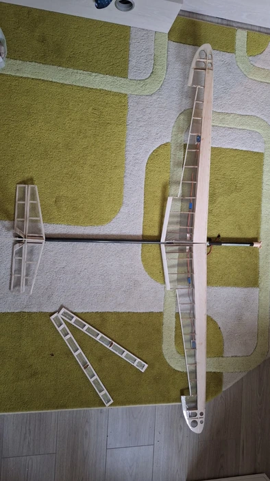
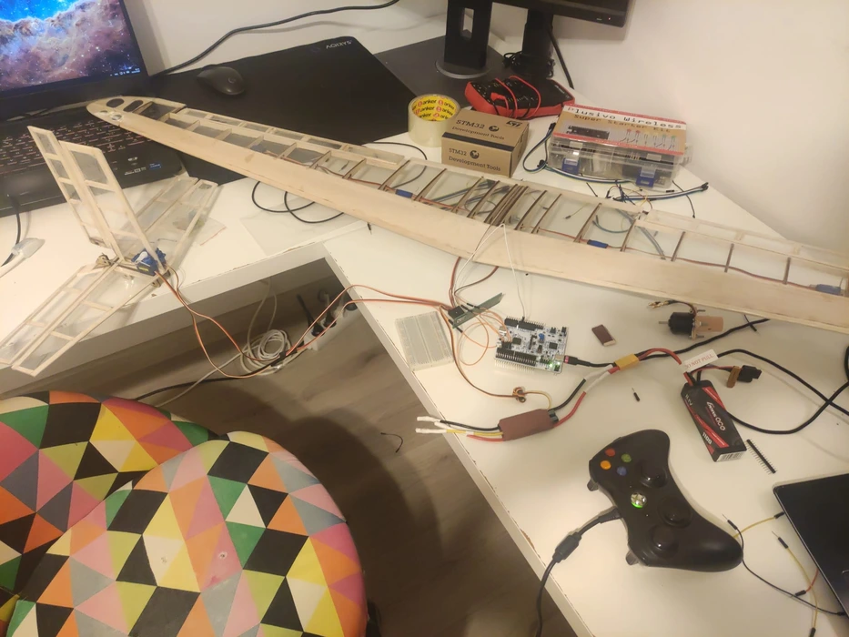

# Fixed Wing RC Drone

A remote controled fixed wing drone

:::info

**Author:** Vlad Buruleanu  \
**Github Project Link:** https://github.com/UPB-PMRust-Students/fils-project-2026-vladburuleanu

:::

## Description
The aim of this project is to build a reliable UAV system that includes:
- The drone itself
- A flight controller that actuates control surfaces and sends over telemetry
- The ground station that is used to pilot the drone remotely

## Motivation

Commercial RC drones and receiver/transmitter systems are often expensive. The goal is to develop a similar system on a smaller budget with some parts I already have lying around.

## Architecture

## Log

# Weeks 5-6

Ordered necessary hardware components and started the development process of the drone, running simulations and making rough calculations to figure out optimal flight configuration.

# Weeks 7-8

Finished 3d design of wing and tail structure.

# Week 9-10

# Week 11-12

# Week 13-14
Designed and laser-cut the drone elements from balsa and ply wood.
Assembled the main wing and ampenage.
Due to time constraints I replaced the raspberry pi pico with an stm32 for faster development.
NRF24L01 modeules turned out to be broken after a long trobleshooting session, so i will have to resort to a wired demonstrarion.

## Hardware

The flight controller is designed around a Raspberry pi pico 2W microcontroller which controls the servo motors and brushlless(via PWM) motor responsible for actuating the control surfaces and providing thrust. The microcontroller is further responsible with collecting and sending telemetry data to the ground station via the NRF24L01+ RF module(via SPI). Telemetry data includes battery level and link quality. The battery level will be measured by reading the battery voltage from the balance pins with a voltage divider to protect the sensitive analog pins of the raspberry pi. Reverse polarity protection is added using a P-channel  Mosfet.

The Ground Station is centered around a Raspberry pi Zero 2W, who's main purpose is to take input from an XBOX360 controller and transmit it over to the drone. It also displays some telemetry data on the OLED display.

### Schematics

### photos

### Bill of materials

| Device | Usage | Price |
| :--- | :--- | :--- |
| STM32 Board | ground station computer | _ RON |
| NRF24L01+ x2 | RF transmitter/recievers | _ RON |
| OLED 128x64 pixels I2C | display | _ RON |
| raspberry pi pico 2W | microcontroller/ flight computer | _ RON |
| servo motor sg90 x4 | turning control surfaces | _ RON |
| Li-Po, 1100mAh, 11.1V, 60C, 3S1P | drone power source | _ RON |
| ESC Fly Pro 40A | electronic speed controller | _ RON |
| Brushless motor A2212/ 1000 KV | provides thrust | _ RON |
| 11 x 4.7 inch propeller | propeller | _ RON |

## Software

| Library | Description | Usage |
|---------|-------------|-------|
| [embassy-executor](https://github.com/embassy-rs/embassy) | Async task executor for embedded systems | Runs concurrent tasks |
| [embassy-time](https://github.com/embassy-rs/embassy) | Time management and timers | Handles scheduling, delays |
| [embassy-rp](https://github.com/embassy-rs/embassy) | HAL for RP2350 chip | GPIO, SPI, I2C, UART, PWM |
| [embassy-sync](https://github.com/embassy-rs/embassy) | Async synchronization primitives | Switches between RF receive task and servo task |
| [embedded-hal-async](https://github.com/rust-embedded/embedded-hal) | Async hardware abstraction traits | Common interface for SPI, I2C |
| [embedded-nrf24l01](https://github.com/astro/embedded-nrf24l01) | nRF24L01+ radio driver | Receiving/sending data |
| [cortex-m](https://github.com/rust-embedded/cortex-m) | Low level ARM Cortex-M support | Required for Rust on RP2350 |
| [cortex-m-rt](https://github.com/rust-embedded/cortex-m-rt) | Startup and reset handler | Entry point for firmware |
| [defmt](https://github.com/knurling-rs/defmt) | logging framework | Debug output during development |
| [panic-probe](https://github.com/knurling-rs/defmt) | Panic handler | Readable panic messages |

## Links

1. [Embassy - Async Rust for Embedded](https://embassy.dev/)
2. [course lab]https://embedded-rust-101.wyliodrin.com/
